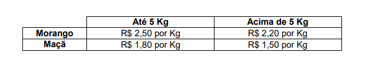
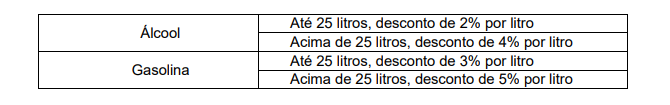

# Resolvendo problemas

Aqui estão exercícios que executei para meu aprendizado em lógica de programação, usando a linguagem C como meu "lápis"!

## Quer aprender Lógica e o básico da linguagem C? 
Confira o curso gratuito que me auxiliou a compreender melhor ambos tópicos:
<a href="https://www.youtube.com/watch?v=2w8GYzBjNj8&list=PLpaKFn4Q4GMOBAeqC1S5_Fna_Y5XaOQS2&ab_channel=PietroMartinsDeOliveira">Professor Pietro</a>

## Exercícios

1. Faça um algoritmo que leia os valores A, B, C e imprima na tela se a soma de A + B é menor que C, caso contrário, imprima que a A + B é maior que C.  
2. Faça um algoritmo que leia o nome, o sexo e o estado civil de uma pessoa. Caso sexo seja “F” e estado civil seja “CASADA”, solicitar o tempo de casada (anos). Por fim, mostre os dados do usuário. 
3. **Idade mínima para dirigir**; Descrição: Peça a idade do usuário. Se a idade for maior ou igual a 18, exiba: "Você pode dirigir". Caso contrário: "Você ainda não pode dirigir". 
4. **Número positivo ou negativo**; Descrição: Peça um número inteiro. Informe se o número é positivo, negativo ou zero. 
5. **Maior de dois números**; Descrição: Peça dois números inteiros. Informe qual é o maior deles. 
6. **Verificação de senha simples**; Descrição: Peça ao usuário uma senha (número inteiro). Se for igual a 1234, exiba "Acesso permitido". Senão, exiba "Senha incorreta". 
7. **Par ou ímpar**; Descrição: Peça um número inteiro. Informe se ele é par ou ímpar. 
8. Escreva um programa que leia do teclado as duas notas de um aluno, calcule e exiba a média aritmética das notas. O programa deve, adicionalmente, exibir uma mensagem de parabéns caso o aluno esteja aprovado (média superior ou igual a 6,0), média até 4,0, o aluno está em recuperação, caso a média seja inferior a 4,0 o aluno será reprovado. 
9. Uma fruteira está vendendo frutas com a seguinte tabela de preços:
  
  Se o cliente comprar mais de 8 Kg em frutas ou o valor total da compra ultrapassar R$ 25,00, receberá ainda um desconto de 10% sobre este total. Escreva um algoritmo para ler a quantidade (em Kg) de morangos e a quantidade (em Kg) de maças adquiridas e escreva o valor a ser pago pelo cliente. 
10. Faça um programa que leia um código de operação (+,-,* ou /), e também dois valores inteiros A
e B. O programa deve calcular o resultado da operação escolhida aplicado a A e B. Por
exemplo, se a operação escolhida foi * e A = 1 e B = 3, o programa deve fornecer como
resultado o valor de 1*3, que é 3.  
11. Faça um algoritmo para ler: a descrição do produto (nome), a quantidade adquirida e o preço
unitário. Calcular e escrever o total (total = quantidade adquirida * preço unitário), o desconto e o
total a pagar (total a pagar = total - desconto), sabendo-se que:
- Se quantidade <= 5 o desconto será de 2%
- Se quantidade > 5 e quantidade <=10 o desconto será de 3%
- Se quantidade > 10 o desconto será de 5%.  
12. Em uma loja de CD´s existem apenas quatro tipos de preços que estão associados a cores.
Assim os CD´s que ficam na loja não são marcados por preços e sim por cores. Desenvolva o
algoritmo que a partir da entrada da cor o software mostre o preço. A loja está atualmente com a
seguinte tabela de preços. 
  
13. Uma financeira usa o seguinte critério para conceder empréstimos: o valor total do empréstimo
deve ser até dez vezes o valor da renda mensal do solicitante e o valor da prestação deve ser no
máximo 30% da renda mensal do solicitante. Escreva um programa que leia a renda mensal de
um solicitante, o valor total do empréstimo solicitado e o número de prestações que o solicitante
deseja pagar e informe se o empréstimo pode ou não ser concedido.  
14. Um posto está vendendo combustíveis com a seguinte tabela de descontos: 

  Escreva um algoritmo que leia o número de litros vendidos e o tipo de combustível (codificado da seguinte forma: A-álcool, G-gasolina), calcule e imprima o valor a ser pago pelo cliente sabendo-se que o preço do litro da gasolina é R$ 6,59 e o preço do litro do álcool é R$ 3,79.
